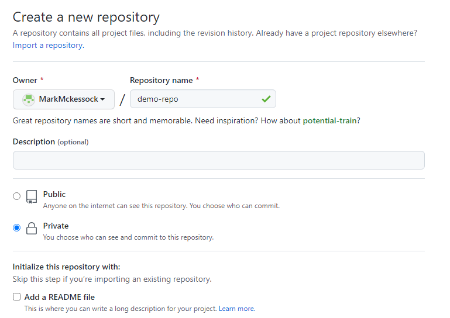
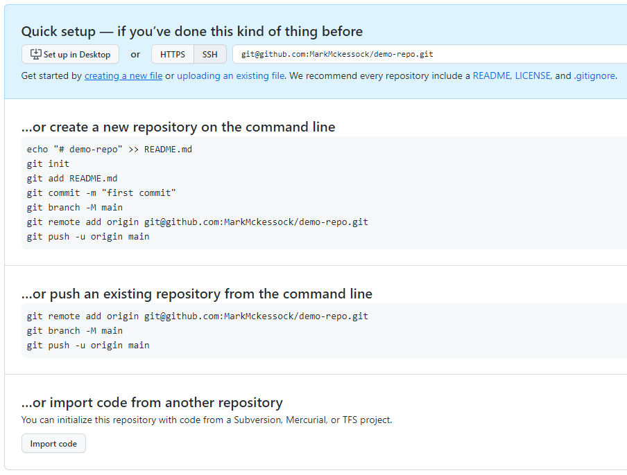
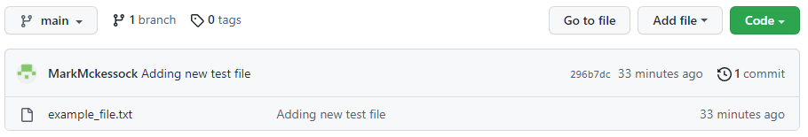
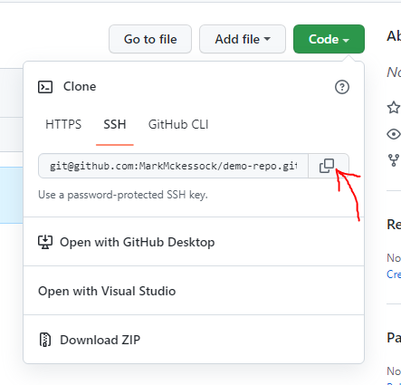
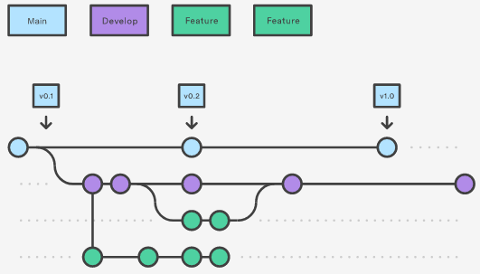
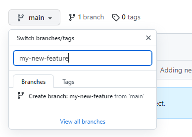
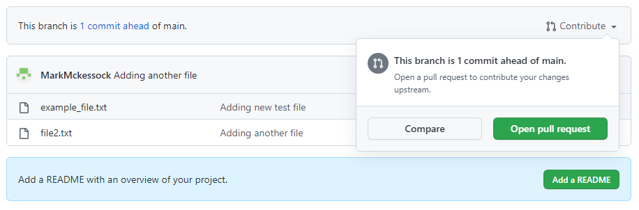
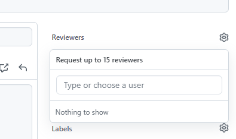

# Source Control & Git
When we write code for the rover, we want to have a central place to store and view that code aswell as the ability to track changes. That is where Source Control comes in. Source Control is a software development concept in which we track changes to our code and gives us the ability to rollback changes that introduced bugs and collaborate together more effectively.

There are a number of solutions for source control (Git, Mercurial, Subversion) but Git is by far the most popular and is what we use on the team. Install Git from [this link](https://git-scm.com/book/en/v2/Getting-Started-Installing-Git) before continuing.

### Creating a Repository
Each git project has at least one repository. A repository is a collection of related but there is not hard-and-fast rule for what a repository should contain. Many developers use a single repository for each application or each component of an application while other use a single repository (referred to as a mono-repo) for all of their project files).

A git repository is created using the following command:
```
$ git init
Initialized empty Git repository in /path/to/repo
```
### Committing Files
Once a repository has now been created we need to add some files to it. Creating/modifying files within a git repository directory will not automatically add the files to the repository. 

If we run the `git status` command, we see that our files are listed as 'untracked':
```
$ git status
On branch master

No commits yet

Untracked files:
  (use "git add <file>..." to include in what will be committed)
        example_file.txt

nothing added to commit but untracked files present (use "git add" to track)
```
As indicated in the above output, we need to run the `git add` command to include our desired files in the commit. If you only want to include certain files, you can `git add` them individually or use a wildcard. If you want to include all the contents of the current directory, use the command `git add .` where the '`.`' will match everything.

After running `git add .`, we can see that our file is now *staged*. Files added with `git add` are staged and will be included in the next commit.
```
$ git status
On branch master

No commits yet

Changes to be committed:
  (use "git rm --cached <file>..." to unstage)
        new file:   example_file.txt
```

We can now run `git commit` to store our changes and create a commit. Each commit must include a commit message which should be descriptive enough to indicate what you changed in the commit.
```
$ git commit -m "Adding new test file"
[master (root-commit) 296b7dc] Adding new test file
 1 file changed, 0 insertions(+), 0 deletions(-)
 create mode 100644 example_file.txt
```

## Github
Creating local repositories and commits is great for tracking and organizing personal projects but isn't much use when we want to work with others. Hosted git repositories such as Github, Gitlab and Bitbucket allow us to host our code on a central server and share our commits with others.

### Create a Github Repository
The first step to pushing our code to Github is to create a Github repository. Go to Github and click the 'New Repository' button. You will see the following menu: 

Choose a good name for the repo and, if you want add a description then click 'Create Repository'. The next screen has the information we need to publish our code to the repository we just created:


Since we have already created a local repository, we need to link it to the Github repository. To do that, we run the following commands:
```
$ git remote add origin git@github.com:MarkMckessock/demo-repo.git
$ git branch -M main
$ git push -u origin main
Enumerating objects: 3, done.
Counting objects: 100% (3/3), done.
Writing objects: 100% (3/3), 231 bytes | 231.00 KiB/s, done.
Total 3 (delta 0), reused 0 (delta 0), pack-reused 0
To github.com:MarkMckessock/demo-repo.git
 * [new branch]      main -> main
Branch 'main' set up to track remote branch 'main' from 'origin'.
```
The first command will add our Github repo as a *remote* for our local repo. (A remote is just a git repository hosted on another server that we can push code to) The second command will make sure we have the 'main' branch selected and the final command will push our existing commits to the repo. If we refresh the Github page, we will see our files have been added:


### Cloning a Repository
If we want to take a remote repository, such as one hosted on Github, and download it to our local machine, that is a process called cloning. Cloning a repository will give us all the contents of the repo as well as all the commit history and past changes.

First, we need to grab the repo URL. On Github, we can get it by clicking on the green 'Code' button on the main page of any repository and copying the HTTPS/SSH link.


Once we have the URL, go to the command line and run the following:
```
$ git clone git@github.com:MarkMckessock/demo-repo.git
Cloning into 'demo-repo'...
remote: Enumerating objects: 3, done.
remote: Counting objects: 100% (3/3), done.
remote: Total 3 (delta 0), reused 3 (delta 0), pack-reused 0
Receiving objects: 100% (3/3), done.
```
The repository has now been cloned to your workstation.

### Working on Team Repos
One concept that many developers try to stick to is to ensure that the code in the master/main branch is always good, executable code. That means that we don't want to be committing untested and possibly buggy code directly to main. Instead, we should work on new features in their own branch, test them and then merge the feature branch back into main once we are done. This is referred to as the GitFlow workflow and there's lots of information available about it.


If you want to create a new feature or fix a bug, the first step is to create a new branch. This can be done from Github or from the command line. On Github, click the branches menu for the repo, type a name for your new branch, and click 'Create branch':


On your local machine, make sure you have the repository cloned and open a terminal in the root of the repository. Run the following command:
```
$ git checkout my-new-feature
Switched to a new branch 'my-new-feature'
Branch 'my-new-feature' set up to track remote branch 'my-new-feature' from 'origin'.
```
This will checkout your newly created branch and any changes you make will now be made to your branch, not the main branch. You can now begin working on your changes. Once you are finished your feature or fixes move on to the next section.

### Merging & Code Review
Once you have completed work on a new feature or bug fix, you'll want to merge your changes back into the main branch so that everyone else can use your changes. To merge code on Github, we have to create a 'Pull Request'.

1. On Github, open your branch that you want to merge and click 'Contribute' and 'Open pull request'.

2. Create a name for the pull request. The name should provide a summary of the changes made in the pull request. Also add a description containing details such as what problem the pull request solves and any issues you encountered.

    Sometimes, when you are merging a commit containing a file that has also been modified by someone else you'll run into something called a merge conflict. Merge conflicts are often some of the hardest challenges you'll encouter when dealing with version control and should be dealt with thoughtfully. Sometimes the merge conflict is simple and git can resolve the issue itself, but often you will have to explicitly tell git which changes you want to keep from each version of the file. When in doubt, ask for help.

3. Add reviewers. No one writes perfect code and we all make mistakes. A great way to minimize bugs and improve the quality of our code is by having other members of the team review our code before we merge it. Add another member of the team (doesn't have to by a lead) to review your code. 

    

4. Once your PR has been created and your reviewer(s) have had a chance to look it over and provide feedback, you are ready to merge you PR. Click the 'Merge pull request' button and you changes will be merged into the target branch. You'll want to run `git pull` for the changes to show up on your local checkout.